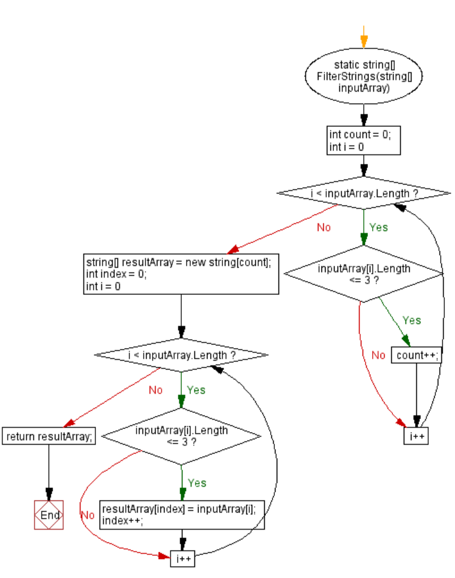

## Это файл содержит скриншот блок схемы данново кода:
 

 # Описание: 
 
 ## Начало программы:

Вывести приглашение для ввода строк массива.
Прочитать введенные строки и разделить их на массив.
## Инициализация переменных:

Создать переменные для хранения количества подходящих строк и индекса в новом массиве.
## Фильтрация строк:
 
Используя цикл, пройти по каждой строке в исходном массиве.
Если длина строки меньше или равна 3 символам, увеличить счетчик подходящих строк.
## Создание нового массива:

Создать новый массив строк с размером, равным количеству подходящих строк.
## Заполнение нового массива:

Используя еще один цикл, пройти по исходному массиву.
Если длина текущей строки меньше или равна 3 символам, добавить ее в новый массив.
## Вывод результата:

Вывести новый массив строк.
## Конец программы.
 " END "